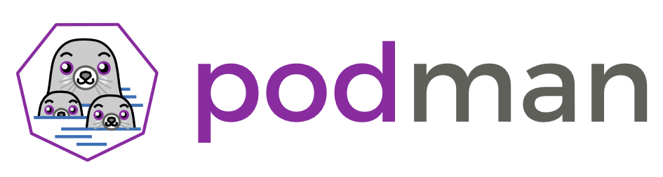
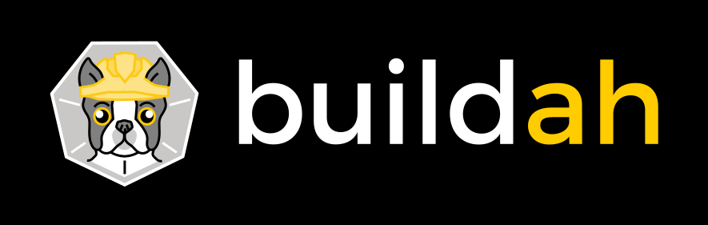
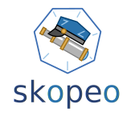
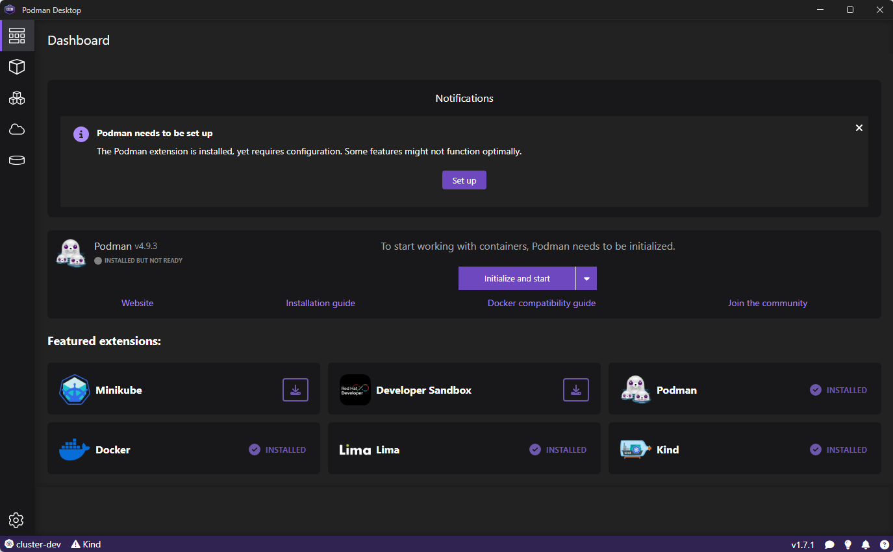

# Podman

## Introduction

Podman - pour POD manager – est un outil de création, gestion et exécution de conteneurs OCI
développé par Red Hat et fonctionnant sur les systèmes Linux.

C’est une alternative à Docker qui apporte ses spécificités, la première étant son
fonctionnement daemonless : Podman n’a pas besoin d’un daemon qui s’exécuterait en arrière-plan
pour son fonctionnement (modèle de Docker). Ce mode daemonless permet à des utilisateurs
sans privilège spécifique de gérer, créer et exécuter des images via Podman.

Un concept important dans Podman est celui de POD, qu’il emprunte (en simplifiant) à Kubernetes.
Un POD peut être constitué d'un ou plusieurs conteneurs en cours d’exécution (une image
Nginx et un serveur d’application Java par exemple). Ce groupe de conteneurs va partager des
ressources (espace de stockage, espace réseau, ...) ce qui assure une intégration facilitée.

Les commandes Podman sont proches voire identiques aux commandes Docker, ce qui facilite la
première expérience des utilisateurs habitués à l’outil : ```podman build```, ```podman run```...
Ceux qui le souhaitent peuvent même continuer d'utiliser la CLI Docker avec Podman qui assure le
traitement des commandes demandées, simplement avec un bind sur la socket Docker habituelle.

Au niveau outillage, Podman fait partie de la suite de logiciels développés par Red Hat, avec
également [Buildah](https://github.com/containers/buildah) et
[skopeo](https://github.com/containers/skopeo). En résumé :

> Buildah builds, Podman runs, and Skopeo transfers container images.





Et Podman Desktop est l'interface graphique qui permet l'utilisation de Podman sans utiliser la
ligne de commande :



## Installation sur Windows

La documentation officielle détaille pas à pas le processus d'installation. Le premier point
important est de s'assurer la présence de WSL (Windows subsystem for Linux) qui va permettre le
fonctionnement de Podman. Ensuite, il faut télécharger l'exécutable d'installation (disponible sur
le Github de Podman). Après l'installation, si tout fonctionne correctement on peut déjà obtenir
la version installée de podman :

```
> C:\Users\Baptiste>podman -v
podman version 4.9.3
```

A partir de là, il va falloir créer une "machine Podman"

## Premières commandes

Aujourd'hui, le monde des conteneurs s'articule quasiment exclusivement autour des systèmes Linux.
Les utilisations sur Windows&Mac sont dédiées au développement, à l'apprentissage, aux tests...
Podman ne fait pas exception et son utilisation sur Windows/Mac passe par un "Podman machine",
un système Linux embarqué qui va faire office de support pour l'exécution du programme Podman.
Sur Windows spécifiquement, ce système fonctionne via WSL2.

Pour les premières commandes, on part du principe que WSL2 est installé sur la machine :

```
>> C:\Users\Baptiste>podman machine init
Downloading VM image: fedora-podman-amd64-v39.0.47.tar.xz: done
(...)
Machine init complete
To start your machine run:

        podman machine start

>> C:\Users\Baptiste>podman machine start
Starting machine "podman-machine-default"
(...)
>> C:\Users\Baptiste>podman run quay.io/podman/hello
!... Hello Podman World ...!

         .--"--.
       / -     - \
      / (O)   (O) \
   ~~~| -=(,Y,)=- |
    .---. /`  \   |~~
 ~/  o  o \~~~~.----. ~~
  | =(X)= |~  / (O (O) \
   ~~~~~~~  ~| =(Y_)=-  |
  ~~~~    ~~~|   U      |~~

Project:   https://github.com/containers/podman
Website:   https://podman.io
Desktop:   https://podman-desktop.io
Documents: https://docs.podman.io
YouTube:   https://youtube.com/@Podman
X/Twitter: @Podman_io
Mastodon:  @Podman_io@fosstodon.org
```

**Et voilà !** Maintenant nous sommes prêts à utiliser Podman et sa ligne de commande
(ou Podman et son IHM) pour travailler avec nos images & conteneurs.

## Podman, Pod & Kubernetes

Un des points intéressants de Podman est la possibilité de transformer un POD (composé de
plusieurs conteneurs) en descripteur pour réaliser un déploiement sur une plateforme Kubernetes.
L'objectif est d'offrir un outil simple pour les développeurs qui découvrent Kubernetes
et qui ont besoin de faire un déploiement (sur un cluster de dev par exemple).

_Création d'un premier pod :_

```
>> C:\Users\Baptiste>podman pod create -n hello-podman-pod --publish=18400:80
d3182e2680e2a872af0bae419e32bb8baa4456520aeec05e5db9b04c11272023

>> C:\Users\Baptiste>podman pod ps
POD ID        NAME              STATUS      CREATED        INFRA ID      # OF CONTAINERS
d3182e2680e2  hello-podman-pod  Created     5 seconds ago  08c481b27f34  1
```

A la création le POD est en statut "Created", il contient un conteneur "infra" qui a un rôle uniquement
technique (permettre au POD d'exister même sans conteneur en cours d'exécution à l'intérieur du POD).
Nous allons maintenant ajouter un conteneur "métier" à notre POD.

_Ajout d'un conteneur :_

```
>> C:\Users\Baptiste>podman run -d --pod hello-podman-pod nginx:latest
daf022a5ac39a39a31c27cf30d3035531b056843a34ddf47a749e07ff1ff4546

>> C:\Users\Baptiste>podman ps --pod
CONTAINER ID  IMAGE                                    COMMAND               CREATED         STATUS         PORTS       NAMES
  POD ID        PODNAME
08c481b27f34  localhost/podman-pause:4.9.3-1708357294                        3 minutes ago   Up 18 seconds              d3182e2680e2-infra  d3182e2680e2  hello-podman-pod
daf022a5ac39  docker.io/library/nginx:latest           nginx -g daemon o...  18 seconds ago  Up 18 seconds              amazing_easley      d3182e2680e2  hello-podman-pod

>> podman pod start hello-podman-pod

>> C:\Users\Baptiste>curl -I localhost:18400
HTTP/1.1 200 OK
Server: nginx/1.25.4
Date: Wed, 28 Feb 2024 14:45:11 GMT
```

_Génération d'un descripteur pour K8s:_

```
C:\Users\Baptiste>podman generate kube hello-podman-pod
# Save the output of this file and use kubectl create -f to import
# it into Kubernetes.
#
# Created with podman-4.9.3
apiVersion: v1
kind: Pod
metadata:
  creationTimestamp: "2024-02-28T14:27:12Z"
  labels:
    app: hello-podman-pod
  name: hello-podman-pod
spec:
  containers:
  - args:
    - nginx
    - -g
    - daemon off;
    image: docker.io/library/nginx:latest
    name: naughtymcnulty
    ports:
    - containerPort: 80
      hostPort: 18400
```

## Conclusion

La principale différence entre des conteneurs exécutés par le daemon Docker ou par Podman se
trouve dans le fait que via Podman (en mode rootless) les conteneurs n'ont pas d'IP. Mais en règle
générale (et surtout en utilisant les POD) c'est plus un changement d'habitude qu'un point bloquant.

En dehors de ce point, on trouve avec un Podman un outil moderne, flexible et très puissant pour
travailler avec ses conteneurs. De nombreux développeurs seront séduits par les capacités de Podman,
et dans mon cas il va rapidement devenir un must-have sur mon poste de dev.

